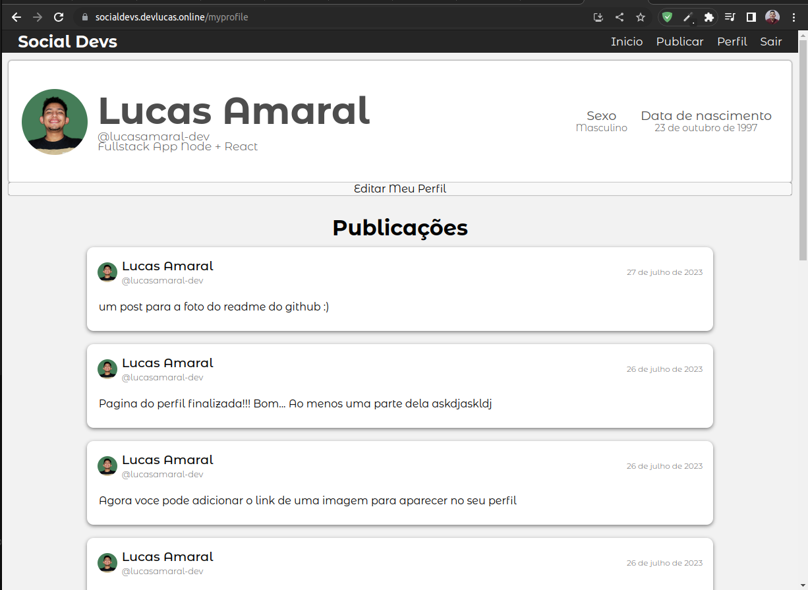
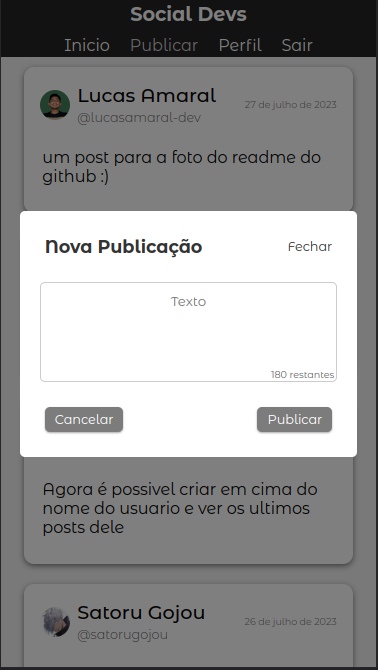

# FRONTEND REDE SOCIAL

Aqui informo a você um pouco do que ja foi feito no frontend da aplicação ate o momento!!

 

<h1>Tecnologias que foram usadas no frontend até o momento</h1>

    -ReactJS
    -React-Router-Dom
    -React-Hook-Form

 
 
<h1>Imagem das paginas</h1>

<h2>Pagina de login</h2>

Pagina de login com validação de dados antes do envio e autenticação com o backend

 

<h2>Pagina de cadastro</h2>

Assim como a pagina de login. essa pagina possui pre validação com react-hook-form antes do envio para o backend

 

<h2>Homepage</h2>

Essa pagina não é acessivel ao menos que o usuario esteja logado

 

<h2>Modal para realizar publicações</h2>

Esse modal é acessivel apenas quando o usuario está logado

 

<h2>Pagina de Meu perfil</h2>

Nessa pagina é renderizada as informações do usuario que esta logado no momento ela existe um botão para editar informações do perfil

ao clicar no botão o modal abaixo é renderizado

 

<h2>Pagina para ver outros perfis</h2>

Essa pagina pode ser visualzada mesmo que o usuario não esteja logado

ela pode ser acessada desse modo:

    {url_base_do_site}/profile/:username

 
 
 

<h1>Segue abaixo imagens do layout em modo mobile</h1>

